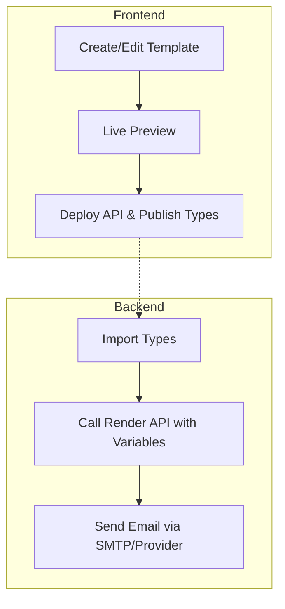

# React Email Template Bootstrap

A professional, unopinionated starting point for building and managing React-based emails across your organization.

## 🚀 The Goal
Separate **Email Design** (Frontend) from **Email Triggering** (Backend).



## 🛠 Features
- **Scaffolding**: `yarn gen:email` to quickly create new templates.
- **Live Preview**: Local development environment with hot reloading via [React Email](https://react.email/).
- **Type-Safe**: Automatically generates TypeScript definitions for all templates.
- **API Ready**: Built-in Express server to render emails to HTML/Text on the fly.
- **Tailwind CSS**: Pre-configured for modern styling.
- **CI/CD Ready**: Workflows for automated versioning, publishing, and deployment.

## 🏁 Quick Start

### 1. Setup the Repository
Clone this template and update the following in `package.json`:
- `name`: Change to `@your-org/email-templates` (or your preferred name).
- `repository`: Update to your GitHub URL.

### 2. Environment Configuration
Copy `.env.sample` to `.env` and adjust as needed:
```bash
cp .env.sample .env
```
- `PORT`: (Optional) Port for the API server (default 8080).
- `BASE_URL`: The URL of your frontend application.
- `BASE_ASSET_URL`: The URL where your email assets/images are hosted.

### 3. Development Workflow

**Create a new email template:**
```bash
yarn gen:email
```
This scaffolds a new `.tsx` file in `emails/` using Plop.

**Preview emails:**
```bash
yarn dev
```
Open `http://localhost:3000` to see the live preview.

### 4. CI/CD & Deployment

- **API**: Deploy the `Dockerfile` to your preferred host. **Serverless environments (like Google Cloud Run or AWS Fargate) are highly recommended** for cost-efficiency and automatic scaling.
- **Types**: Publish the package to a private registry (GitHub Packages, NPM) so your backend can consume the generated types.

Check `.github/workflows` for pre-configured GitHub Actions.

## 🔌 Backend Integration

Install your private package:
```bash
npm install @your-org/email-templates
```

Use the types to call the API with full type-safety:
```typescript
import { EmailRenderPayload } from '@your-org/email-templates';

// TypeScript will enforce correct variables based on the template!
const payload: EmailRenderPayload<'general', 'christmas'> = {
  emailModule: 'general',
  template: 'christmas',
  variables: {
    email: 'recipient@example.com',
    name: 'John Doe',
  }
};

const response = await fetch('https://your-email-api.com/api/render', {
  method: 'POST',
  body: JSON.stringify(payload),
  headers: { 'Content-Type': 'application/json' }
});

const { html, text } = await response.json();
```

## 📜 API Reference
- `POST /api/render`: Returns JSON `{ html: string, text: string }`.
- `POST /api/render/html`: Returns raw HTML body.
- `POST /api/render/text`: Returns plain text body.

## 🧪 Scripts
- `yarn dev`: Start the preview server.
- `yarn dev:api`: Start the API server locally.
- `yarn gen:email`: Scaffold a new email.
- `yarn gen:templates`: Re-generate the template index and types.
- `yarn build:api`: Build the production API.
- `yarn build:types`: Build the TypeScript definitions.

## 📄 License
This project is licensed under the MIT License - see the [LICENSE](LICENSE) file for details.

---
If this project helped you, please consider giving it a star!